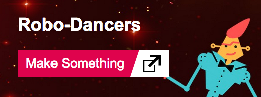
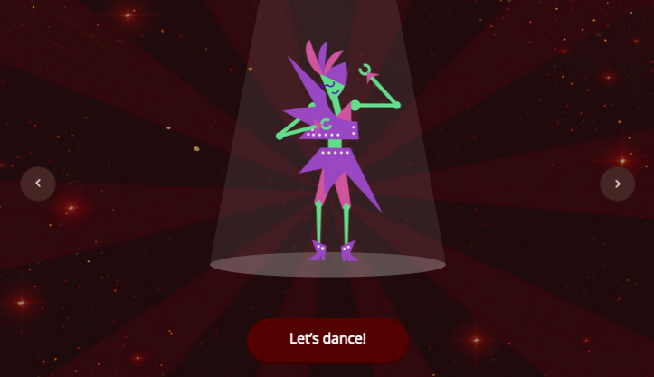
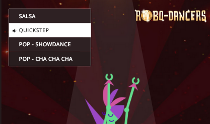

## Getting started

Choose a robot and some music to dance to.

+ Go to the Robo-Dancers webpage at <a href="http://jumpto.cc/robo" target="_BLANK">jumpto.cc/robo</a>, and click 'Make Something' to get started.

+ Press the left and right arrows to choose your dancer, and click 'Let's dance' when you've chosen one.

+ You can also choose the music that your robot dances to.

