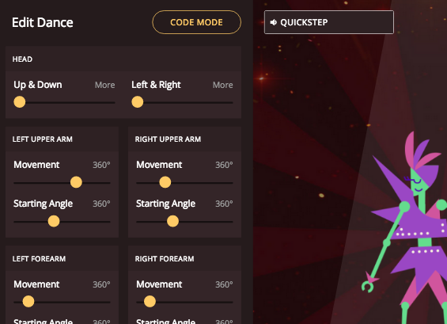

## Customising your dance

Control how your robot dances.

+ Click and drag the yellow sliders to change how different body parts move.

You can alter the amount of __movement__ and the __starting angle__ of your robot's body parts.

