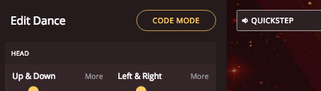
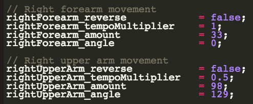

## Code mode

Let's code your robot's dance.


+ Click 'Code Mode' to start coding your robot.



+ Scroll down, and for each body part you'll see a number of __variables__.

 

+ Change the `rightUpperArm_reverse` variable from `false` to `true`.

```
rightUpperArm_reverse = true
```

Click 'Run the code', and you should see the right arm move in the opposite direction.

+ Set the `rightUpperArm_tempoMultiplier` to `2` and click 'Run the code'.

```
rightUpperArm_tempoMultiplier	= 2;
```

This will make the right upper arm move __twice as fast__ as the music. You can use a value like `0.5` to make the arm move at half the speed of the music.

+ You can also change the `amount` and `angle` of movement.

```
rightUpperArm_amount	= 98;
rightUpperArm_angle 	= 129
```

The `amount` can be between `0` and `150`, and the angle between `0` and `360` degrees.

