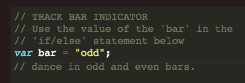
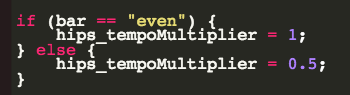

## Dancing to bars

Make your robot dance differently to different parts of the music.


+ A __bar__ is a set of 4 beats.

If you look at the top of the code, you'll see that a variable called `bar` changes from odd to even every 4 beats.

 

You can use this variable to change how your robot dances in odd and even bars.

+ This code decides how fast the hips move:

 

This means that the hips move at normal speed during `even` bars and at half speed during `odd` bars.

+ You can copy and paste any variables into this code, to make the robot dance differently during odd and even bars.

For example, you can just make the hips move during odd bars:

```
if (bar == "even") {
	hips_tempoMultiplier 	= 1;
	hips_leftRight 			= 0;
} else {
	hips_tempoMultiplier 	= 0.5;
	hips_leftRight 			= 10;
}
```

